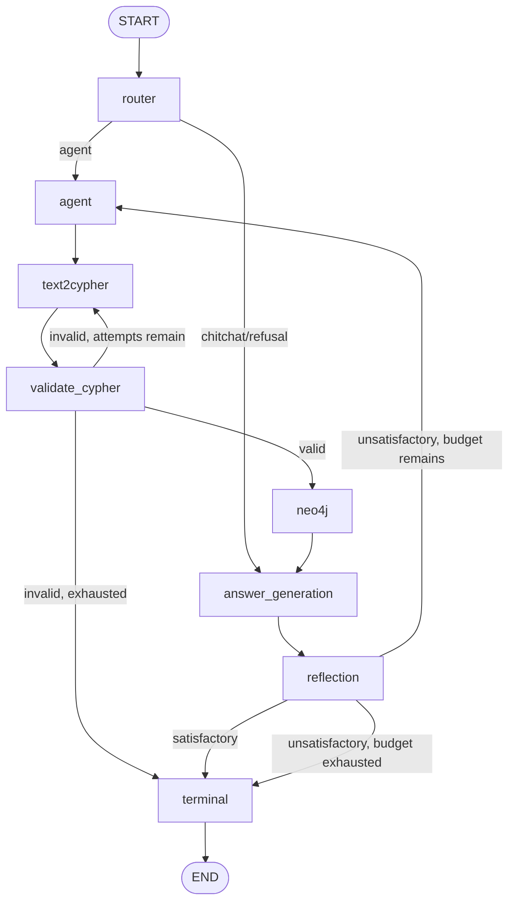

# Architecture 2 LangGraph view

```mermaid
flowchart TD
    START([START]) --> router
    router -->|agent| agent
    router -->|chitchat/refusal| answer_generation
    agent --> text2cypher
    text2cypher --> validate_cypher
    validate_cypher -->|valid| neo4j
    validate_cypher -->|invalid, attempts remain| text2cypher
    validate_cypher -->|invalid, exhausted| terminal
    neo4j --> answer_generation
    answer_generation --> reflection
    reflection -->|satisfactory| terminal
    reflection -->|unsatisfactory, budget remains| agent
    reflection -->|unsatisfactory, budget exhausted| terminal
    terminal --> END([END])
```
